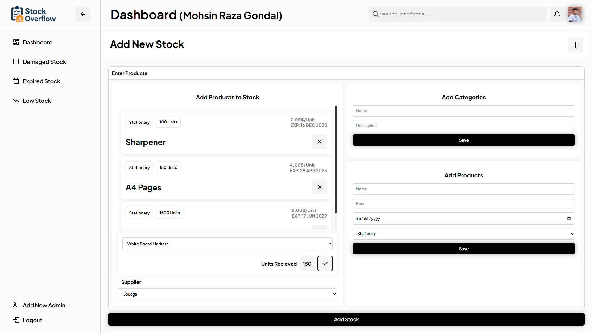

# 📦 Inventory Management System

This is a full-stack **Inventory Management System** built using `Node.js`, `Express`, and `MySQL` with EJS templating on the frontend.
This project was part of my learning phase. It's a simulation of an inventory system done using core web technologies and SQL. It’s not perfect — but it helped me grow.
---

## 🔧 Features

- 🧾 Admin Login and Register (with Profile Image)
- 📦 Add Products, Suppliers, and Categories
- 📊 Dashboard with stock statistics
- 📉 Low Stock / Expired Stock / Damaged Stock Management
- 🔔 Real-time Notifications
- 📈 Add New Stock with Quantity & Supplier Details
- 📁 File Upload using Multer
- 🗃️ Organized Codebase with custom utility functions
- 🔐 Session-based Authentication using express-session

---

## 🧪 Tech Stack

- **Backend:** Node.js, Express.js
- **Frontend:** HTML, CSS, JavaScript, EJS
- **Database:** MySQL
- **Other Tools:** Multer, express-session, dotenv, method-override

---

## 📸 Screenshots
> Dashboard
> 
> New Stock
> 

---

## 📂 Project Structure

```bash
├── public/             # Static Assets
├── views/              # EJS Templates
│   ├── components/     # Dynamic Partials
│   └── pages/          # Full Pages
├── DB/                 # All MySQL Queries & Config
├── routes/             # Routes (Future Improvement)
├── profiles/           # Uploaded Profile Images
├── app.js / index.js   # Main Entry Point
